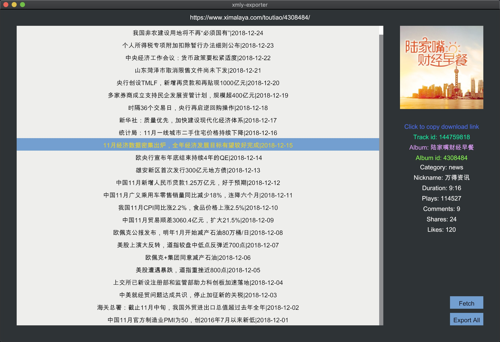

## Intro

**[xmly](https://www.ximalaya.com) crawler in pure Rust**

#### Installation

1.  Complie from source (recommend)
   - `git clone https://github.com/AurevoirXavier/xmly-exporter.git`
   - `cargo build --release` (rust version 1.33.0 nightly)
2.  Download release
   - [OS X Mojave (10.14.2 18C54)](https://github.com/AurevoirXavier/xmly-exporter/releases/download/1.0/xmly-exporter)
   - [Windows](https://github.com/AurevoirXavier/xmly-exporter/releases/download/1.0/xmly-exporter.exe)
   - [Linux](#): Not yet

#### Usage

1. `cargo run --release` or run [xml-exporter/xmly-exporter.exe]
2. Copy the url (https://www.ximalaya.com/toutiao/4308484/, https://www.ximalaya.com/toutiao/4308484/147135825). Album and Track are supported
3. **Fetch**: Just click and it will read the url from your clipboard to start fetching
4. **Export All**: Export all tracks’ detail to a **\*.ax** file which for [aria2](https://aria2.github.io)’s **-i** flag. Cause some problem with *Async*, download are not supported now.
5. List select: Click to get the track’s detail as below
6. Button: Color change when click
   - **Click to copy download link**: Just as it told (also copy the title of the track)
   - **Track id**, **Album**, **Album id**: Click to copy
7. Text: **Category**,**Nickname**, **Duration**, **Plays**, **Comments**, **Shares**, **Likes**

#### Screenshot



## Issue

One of these fonts(path) is needed.

```rust
if cfg!(target_os = "windows") {
    ui.fonts.insert_from_file(Path::new("C:/Windows/Fonts/SIMFANG.ttf")).unwrap();
} else {
    ui.fonts.insert_from_file(Path::new("/Library/Fonts/Arial Unicode.ttf")).unwrap();
}
```
